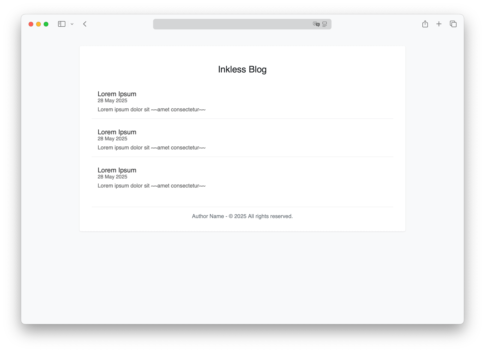

  

# Inkless

**A minimalist, markdown-powered blog engine. No database, no backend. Just pure content.**

## ✨ Features

- Zero database or backend logic
- Markdown-based posts (`.md`)
- Extremely lightweight and portable
- Ideal for static hosting (e.g. Nginx, GitHub Pages, Cloudflare Pages)

## ⚙️ Usage

Simply host the repository on any static file server or CDN platform.

> ⚠️ On local machines (file://), Markdown files may not load due to browser restrictions.  

## 🖼️ Screenshot

## 📄 License

This project is licensed under the [Apache License 2.0](LICENSE).  
You are free to use, modify, and distribute it under the terms of the license.  
Attribution is appreciated.
